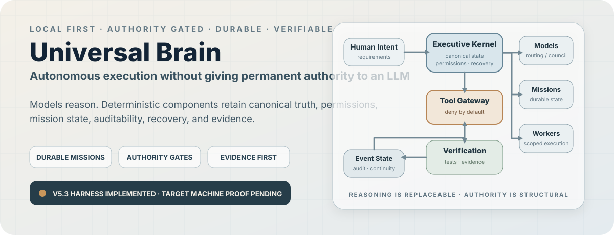
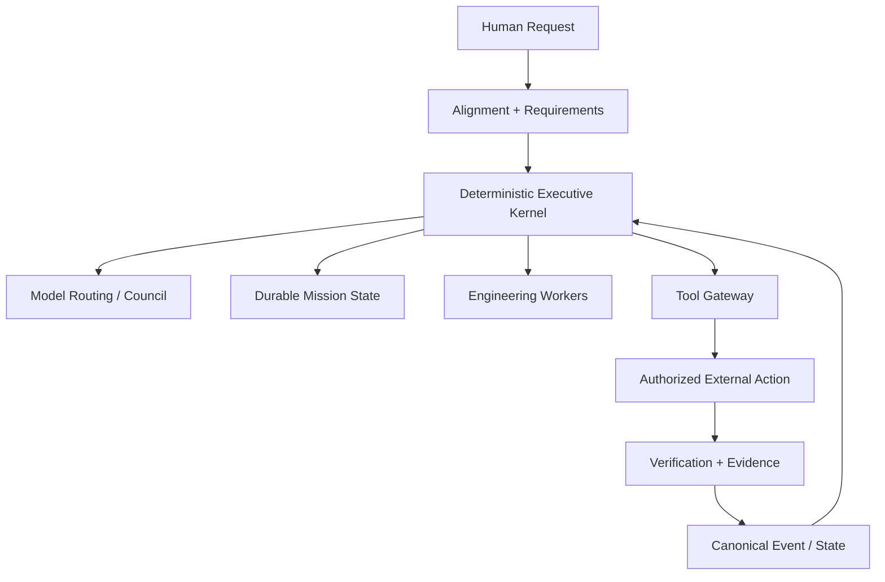

  

  
  
  
  
  
  

  <strong>A local first executive runtime for coordinating models, tools, durable missions, permissions, recovery, and verification without assigning permanent authority to any single LLM.</strong>

> [!IMPORTANT]
> **Current checkpoint:** Universal Brain V5.3 has a real environment validation harness, cross platform verification, durable recovery, authority gated tool execution, evidence sealing, and engineering runtime controls implemented. Windows, WSL2, Hyper V, real Ollama pressure, production LSP, and multi hour target machine endurance remain explicitly unproven until target generated evidence exists.

  <a href="docs/architecture/SYSTEM_ARCHITECTURE.md"><strong>Architecture</strong></a> ·
  <a href="docs/testing/ENGINEERING_AGENCY_V53_VERIFICATION.md"><strong>Verification Record</strong></a> ·
  <a href="docs/security/THREAT_MODEL.md"><strong>Threat Model</strong></a> ·
  <a href="console/"><strong>Operator Console</strong></a> ·
  <a href="docs/RELEASE_READINESS.md"><strong>Release Gate</strong></a>

---

## The Core Idea

Universal Brain separates **reasoning** from **authority**.

Models may propose plans, decompose work, inspect context, and produce candidate actions.

They do not own canonical truth or permanent execution authority.

The deterministic control plane retains:

* canonical state
* capability and permission checks
* mission lifecycle
* audit history
* recovery state
* evidence
* rollback and remediation paths where supported

The design objective is:

> **Make silent misalignment structurally difficult, observable, and recoverable.**

---

## What Exists Today

### Executive Kernel

The deterministic core owns canonical state, permissions, mission lifecycle, health, budgets, checkpoints, and control plane decisions.

No LLM permanently sits at the top of the system.

### Intelligence Fabric

Model identity, provider access, routing, council behavior, and transport are separated from canonical state.

Models are replaceable reasoning services rather than sources of truth.

### Engineering Agency

The engineering runtime coordinates requirement scoped work, code intelligence, verification, worktrees, worker leases, integration, remediation, and restart recovery.

### Tool Gateway

Consequential external actions cross an explicit authority boundary.

Model authored intent is not equivalent to permission.

### Verification and Evidence

Completion is tied to tests, measurements, evidence records, checkpoints, and sealed artifacts rather than a model saying a task is complete.

### Operator Console

The repository includes a React and TypeScript operator console with views for executive activity, governance, intelligence routing, engineering work, event graphs, approvals, and evidence inspection.

---

## Control Plane

The architectural rule is simple:

**Models reason. Deterministic components retain truth, permissions, state, auditability, and recovery authority.**

---

## Evidence Board

| Capability | Evidence | Status |
| --- | --- | :---: |
| **Deterministic executive control plane** | Architecture, implementation, regression coverage | ✅ Implemented checkpoint |
| **Authority gated Tool Gateway** | Capability token and action boundary tests | ✅ Regression tested |
| **Durable mission and checkpoint mechanics** | Persistence and restart recovery controls | ✅ Implemented checkpoint |
| **Multi model intelligence fabric** | Routing, council, fallback abstractions | ✅ Implemented checkpoint |
| **Engineering agency runtime** | Planning, verification, worktree and recovery infrastructure | ✅ Implemented checkpoint |
| **Semantic code / LSP integration** | Contracts, adapters, subprocess fixture coverage | ✅ Environment dependent |
| **Worker and service durability** | Leases, fencing, managed service lifecycle | ✅ Implemented checkpoint |
| **Evidence sealing** | SHA 256 manifests and offline verification | ✅ Implemented |
| **Real Git conflict lab** | Disposable worktrees, deliberate conflict, clean abort | ✅ Cross platform evidence |
| **Cross process restart recovery** | Independent process checkpoint recovery | ✅ Cross platform evidence |
| **Real Windows + WSL2 execution** | Target machine evidence | ◐ Pending |
| **Hyper V execution** | Target machine evidence when used | ◐ Pending |
| **Configured Ollama model pressure** | Real RAM / VRAM target evidence | ◐ Pending |
| **Production language server** | Actual target LSP evidence | ◐ Pending |
| **Two hour or longer mission endurance** | Target machine endurance record | ◐ Pending |

**Implemented is not treated as synonymous with proven in the target environment.**

---

## V5.3 Verification Snapshot

The documented V5.3 verification record from **8 September 2026** reports:

| Gate | Result |
| --- | ---: |
| Dedicated V5.3 tests | **9 passed · 0 failed** |
| V5.2 + V5.3 hardening and evidence slice | **28 passed · 0 failed** |
| Engineering + Intelligence Fabric + Executive + security integration gate | **111 passed · 0 failed** |
| API / core / security regression gate | **32 passed · 0 failed** |
| Python compilation | **PASS** |

The available Linux sandbox validation run produced a **PARTIAL** result:

**PASS**
* platform validation
* generation fenced distributed leases
* disposable Git worktrees with deliberate conflict and clean abort
* authority gated persistent service workload
* cross process checkpoint restart recovery

**SKIP**
* production Tree sitter runtime
* production language server
* WSL2
* Hyper V
* two hour endurance
* Ollama, because it was not configured in that sandbox

The sealed evidence report was independently reloaded and verified after the run.

This is **not Windows deployment proof**.

[**Read the complete V5.3 verification record →**](docs/testing/ENGINEERING_AGENCY_V53_VERIFICATION.md)

---

## V5.3 Target Proof Still Required

Before the deployment label can advance, the project still needs target generated evidence for the applicable runtime configuration, including:

1. real Tree sitter runtime if used
2. a production language server such as pyright, clangd, or rust analyzer
3. the configured Ollama models
4. bounded concurrent Ollama pressure if selected
5. real WSL2 isolation execution through Tool Gateway
6. Hyper V execution if part of the deployment
7. production requirement worktrees and merge coordination
8. real target service workloads
9. runtime restart recovery on the target machine
10. a passing mission or endurance run lasting at least two hours
11. the complete repository test suite with all declared dependencies installed
12. offline verification of the final evidence manifest

A failed applicable target check is evidence and must not be converted into a pass.

---

## Architecture Layers

### 1 · Alignment Spine

Retains original input, requirements, assumptions, non goals, ambiguity classification, constraints, and transition gates.

### 2 · Executive Kernel

Owns model neutral canonical state, capability leases, permissions, budgets, health, mission lifecycle, checkpoints, and evidence indexes.

### 3 · Intelligence Fabric

Routes work across model providers and local runtimes without allowing a model to become canonical state.

### 4 · Goal and Task Engine

Maintains provenance from user input to requirements, tasks, actions, verification, and completion state.

### 5 · Engineering Agency

Coordinates scoped code work, semantic inspection, verification, worker lifecycle, Git worktrees, integration, and recovery.

### 6 · Tool Gateway

Acts as the execution boundary for consequential external effects.

### 7 · Reality and Verification

Runs tests and other verification mechanisms and records evidence rather than accepting model assertion as completion.

### 8 · Memory and Persistence

Maintains durable state separately from transient model context.

### 9 · Audit and Observability

Preserves traceable event history, execution evidence, health, and operator visible state.

---

## Engineering Runtime

The current implementation includes engineering controls for:

* requirement scoped work
* durable missions and checkpoint recovery
* causal and evidence oriented audit
* incremental code graph infrastructure
* semantic sensing and language server adapters
* impact based verification
* scoped Git worktrees
* merge and conflict handling
* dependency diagnosis and remediation
* local model resource admission
* managed service processes
* worker leases and fencing
* target machine validation
* evidence bundling and offline digest verification

The V5.3 phase intentionally focuses on **proof and endurance**, not another cognitive layer.

---

## Operator Console

The repository contains a React and TypeScript operator interface under [`console/`](console/).

Current console surfaces include:

* Executive Stream
* Intelligence Fabric
* Engineering Agency
* Governance
* approval handling
* Event Graph Explorer
* Evidence Viewer

The console is an operator surface over the system. It does not replace the authority and canonical state held by the backend control plane.

---

## Start Here

| If you want to understand | Read |
| --- | --- |
| Overall system boundaries | [System Architecture](docs/architecture/SYSTEM_ARCHITECTURE.md) |
| Executive model and kernel separation | [Executive Brain Spec](docs/architecture/EXECUTIVE_BRAIN_SPEC.md) |
| Model routing and council behavior | [Intelligence Fabric](docs/architecture/INTELLIGENCE_FABRIC_SPEC.md) |
| Engineering runtime | [Engineering Agency V5.3](docs/architecture/ENGINEERING_AGENCY_V53.md) |
| Authority and threat boundaries | [Threat Model](docs/security/THREAT_MODEL.md) |
| Alignment invariants | [Alignment Invariants](docs/alignment/INVARIANTS.md) |
| V5.3 verification | [Verification Record](docs/testing/ENGINEERING_AGENCY_V53_VERIFICATION.md) |
| Target machine validation | [Validation Runbook](docs/infrastructure/V53_REAL_ENV_VALIDATION_RUNBOOK.md) |
| Release policy | [Release Readiness](docs/RELEASE_READINESS.md) |

---

## Major Engineering Checkpoints

| Checkpoint | Focus |
| --- | --- |
| **IF V4** | Multi transport intelligence fabric, routing, council, recovery |
| **EA V5** | Autonomous engineering agency foundation |
| **EA V5.1** | Durable recovery, impact aware verification, worktree integration, resource admission |
| **EA V5.2** | Semantic sensing, stdio LSP, isolation plans, worker fencing, remediation, services |
| **EA V5.3** | Real environment validation harness, target probes, endurance path, evidence sealing |

The exact verification boundary for each checkpoint lives in the corresponding architecture and testing records.

---

## Security and Authority

The public security model is repository local and portable:

* [Threat Model](docs/security/THREAT_MODEL.md)
* [Alignment Invariants](docs/alignment/INVARIANTS.md)
* [V5.3 Verification Record](docs/testing/ENGINEERING_AGENCY_V53_VERIFICATION.md)
* [V5.3 Real Environment Validation Runbook](docs/infrastructure/V53_REAL_ENV_VALIDATION_RUNBOOK.md)

High impact ambiguity is intended to fail closed.

Consequential action authority is centralized rather than delegated implicitly to whichever model is currently reasoning.

---

## Architecture Decision Records

Selected ADRs:

* [ADR 0001 · Local first canonical state](docs/architecture/adr/0001-local-first-selective-cloud.md)
* [ADR 0002 · Version 1 action authority](docs/architecture/adr/0002-version1-action-authority.md)
* [ADR 0003 · Neutral human safety](docs/architecture/adr/0003-human-safety-tie-break.md)
* [ADR 0005 · Universal Executive Brain](docs/architecture/adr/0005-universal-executive-brain.md)
* [ADR 0009 · Intelligence Fabric](docs/architecture/adr/0009-intelligence-fabric-multi-transport-runtime.md)
* [ADR 0012 · Autonomous Engineering Agency runtime](docs/architecture/adr/0012-autonomous-engineering-agency-runtime.md)
* [ADR 0014 · Engineering runtime hardening](docs/architecture/adr/0014-engineering-runtime-hardening.md)
* [ADR 0015 · Real environment validation and endurance](docs/architecture/adr/0015-real-environment-validation-and-endurance.md)

---

## Evidence Policy

Claims stay at the same level as their evidence.

* mock verification is not provider verification
* software tests are not target machine endurance evidence
* a planned isolation boundary is not a production proven sandbox
* a successful model response is not proof of task completion
* a passing harness is not automatically a production claim
* target machine claims require target machine artifacts and provenance

---

## Technology

**Backend**  
`Python 3.12+` · `FastAPI` · `Pydantic v2` · `SQLAlchemy` · `PostgreSQL` · `pgvector` · `httpx`

**Operator Console**  
`React` · `TypeScript` · `Vite`

**Verification / Development**  
`pytest` · `pytest asyncio` · `Hypothesis` · `Ruff` · `mypy`

**Optional runtime surfaces**  
`Playwright` · `pywinauto` · `Tree sitter` · production language servers · local Ollama models

Optional components are not described as target proven unless corresponding evidence exists.

---

## First Public Release

The first public tag should be framed as a **software and architecture checkpoint**, not as proof that the entire autonomous system is production proven.

See:

* [Release Readiness](docs/RELEASE_READINESS.md)
* [Release Notes Draft](docs/RELEASE_NOTES_DRAFT.md)

Blocked claims without target evidence include:

* production proven Windows sandboxing
* production proven WSL2 or Hyper V isolation
* multi hour autonomous reliability
* universal exactly once external action execution
* validated performance across arbitrary local models
* production scale autonomous completion of large software systems
* physical world autonomy or safety certification

---

## Collaboration

Issues and technical discussion are useful for architecture review, failure cases, reproducibility, verification, and scoped engineering feedback.

If the project is useful to your work, **star the repository or follow [VivekVRobo](https://github.com/VivekVRobo)** to track target machine validation and release milestones.

---

## License

**All rights reserved.**

This repository is source visible for review and portfolio purposes. No open source license has been granted.

See [`LICENSE`](LICENSE).
