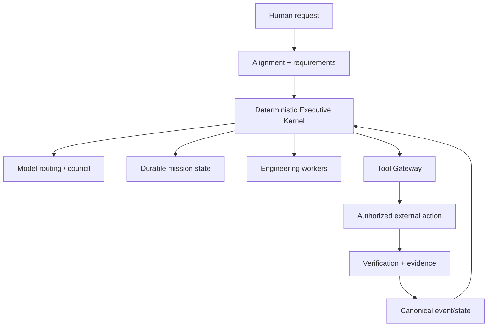

# Universal Brain

**Universal Brain** is a local-first executive runtime for coordinating models, tools, durable missions, permissions, recovery and verification without assigning permanent authority to any single LLM.

It is an engineering project centered on one question:

> **How can an AI-driven system execute useful work while keeping human intent, authority, state, evidence and rollback structurally visible?**

## See the architecture first

The central design rule is simple: **models reason, but deterministic control-plane components retain canonical truth, permissions, state, auditability and recovery authority.**

## Start here

| If you want to understand... | Read this |
| --- | --- |
| System boundaries | [System Architecture](docs/architecture/SYSTEM_ARCHITECTURE.md) |
| Model routing and council behavior | [Intelligence Fabric](docs/architecture/INTELLIGENCE_FABRIC_SPEC.md) |
| Durable engineering missions | [Engineering Agency V5.3](docs/architecture/ENGINEERING_AGENCY_V53.md) |
| Authority and threat boundaries | [Threat Model](docs/security/THREAT_MODEL.md) |
| Alignment invariants | [Alignment Invariants](docs/alignment/INVARIANTS.md) |
| Verified V5.3 tooling | [V5.3 Verification Record](docs/testing/ENGINEERING_AGENCY_V53_VERIFICATION.md) |
| Target-machine validation | [V5.3 Validation Runbook](docs/infrastructure/V53_REAL_ENV_VALIDATION_RUNBOOK.md) |
| First release gate | [Release Readiness](docs/RELEASE_READINESS.md) |

## Why follow this project

Universal Brain is not intended as another prompt wrapper. Development focuses on systems problems that become important when an AI agent is expected to operate for longer than one chat turn:

- durable mission recovery;
- local/cloud model routing without surrendering canonical state;
- explicit authority checks before consequential actions;
- bounded tool execution through a deny-by-default gateway;
- semantic code intelligence and verification;
- multi-repository engineering workflows;
- worker leases and restart recovery;
- WSL2 / Hyper-V isolation planning;
- dependency remediation and rollback;
- evidence-backed completion instead of model self-assertion;
- target-machine endurance and evidence sealing.

If you are interested in **AI agents, local AI, autonomous engineering systems, LLM orchestration, reliability or safety-governed execution**, this repository tracks those implementation and verification milestones.

## Current maturity

The repository contains implemented and tested engineering checkpoints through **V5.3 validation tooling**, while several real-environment claims remain deliberately gated until target-machine evidence exists.

| Area | Current state |
| --- | --- |
| Deterministic executive/control plane | Implemented checkpoint |
| Authority-gated Tool Gateway | Implemented and regression-tested |
| Durable mission/checkpoint mechanics | Implemented checkpoint |
| Multi-model intelligence fabric | Implemented checkpoint |
| Engineering agency runtime | Implemented checkpoint |
| Semantic code / LSP integration | Implemented with environment-dependent adapters |
| Worker/service durability | Implemented checkpoint |
| Real Windows + WSL2 evidence | Pending target-machine validation |
| Real Ollama pressure/endurance evidence | Pending target-machine validation |
| Multi-hour production endurance | Pending target-machine validation |

**Implemented is not treated as synonymous with proven in the target environment.**

## Governing objective

> **Make silent misalignment structurally difficult, observable and recoverable.**

The system does not claim access to unexpressed human intent. Instead, it tries to make explicit instructions and consequential actions traceable through:

- versioned requirements, assumptions and constraints;
- fail-closed handling of high-impact ambiguity;
- centralized permission checks;
- request-bound tool authority;
- evidence-backed completion;
- model-independent state and continuity;
- rollback/remediation paths where supported.

## Architecture layers

### Executive kernel

Owns canonical state, permissions, mission lifecycle and control-plane decisions. No LLM permanently sits at the top of the system.

### Intelligence fabric

Separates model identity, access route and runtime transport. Routing and council behavior are treated as replaceable reasoning services rather than sources of canonical truth.

### Engineering agency

Coordinates requirement-scoped work, code intelligence, verification, worktrees, worker leases, integration and recovery.

### Tool Gateway

All consequential external action is intended to cross an explicit authority boundary. Model-authored intent is not equivalent to permission.

### Verification and evidence

Completion is tied to tests, measurements and recorded evidence rather than a model saying a task is complete.

## Major documented checkpoints

| Checkpoint | Focus |
| --- | --- |
| IF-V4 | Multi-transport intelligence fabric, routing, council and recovery |
| EA-V5 | Autonomous engineering agency foundation |
| EA-V5.1 | Durable recovery, impact-aware verification, worktree integration, resource admission |
| EA-V5.2 | Semantic sensing, stdio LSP, isolation plans, worker fencing, remediation, services |
| EA-V5.3 | Real-environment validation harness, target-machine probes and evidence sealing |

The detailed status and exact verification boundaries live in the architecture and testing documents rather than being compressed into marketing claims here.

## Security and authority

Public security references are repository-local and portable:

- [Threat Model](docs/security/THREAT_MODEL.md)
- [Alignment Invariants](docs/alignment/INVARIANTS.md)
- [V5.3 Verification Record](docs/testing/ENGINEERING_AGENCY_V53_VERIFICATION.md)
- [V5.3 Real-Environment Validation Runbook](docs/infrastructure/V53_REAL_ENV_VALIDATION_RUNBOOK.md)

The previous README referenced a local Windows `file:///C:/...` security-review path. That machine-local reference has been removed from the public entry point because external visitors cannot access it.

## Architecture decision records

Key ADRs include:

- [ADR-0001 — Local-first canonical state](docs/architecture/adr/0001-local-first-selective-cloud.md)
- [ADR-0002 — Version 1 action authority](docs/architecture/adr/0002-version1-action-authority.md)
- [ADR-0003 — Neutral human safety](docs/architecture/adr/0003-human-safety-tie-break.md)
- [ADR-0005 — Universal Executive Brain](docs/architecture/adr/0005-universal-executive-brain.md)
- [ADR-0009 — Intelligence Fabric / multi-transport runtime](docs/architecture/adr/0009-intelligence-fabric-multi-transport-runtime.md)
- [ADR-0012 — Autonomous Engineering Agency runtime](docs/architecture/adr/0012-autonomous-engineering-agency-runtime.md)
- [ADR-0014 — Engineering runtime hardening](docs/architecture/adr/0014-engineering-runtime-hardening.md)
- [ADR-0015 — Real-environment validation and endurance](docs/architecture/adr/0015-real-environment-validation-and-endurance.md)

## Evidence policy

Claims in this repository should stay at the same level as their evidence:

- mock verification is not real-provider verification;
- software tests are not target-machine endurance evidence;
- a planned isolation boundary is not a production-proven sandbox;
- a successful model response is not proof of task completion;
- a passing harness is not automatically a production claim;
- target-machine claims require target-machine artifacts and provenance.

## First public release

The intended first public tag should be a conservative **software/architecture checkpoint**, not a claim that the entire autonomous system is production-proven.

See:

- [`docs/RELEASE_READINESS.md`](docs/RELEASE_READINESS.md)
- [`docs/RELEASE_NOTES_DRAFT.md`](docs/RELEASE_NOTES_DRAFT.md)

A release should only be cut from an exact commit whose required verification gates are green. Windows, WSL2, Ollama pressure and long-duration endurance claims remain excluded until their target evidence exists.

## Public collaboration

Issues and technical discussion are useful for architecture review, failure cases, reproducibility and scoped engineering feedback.

Because this repository is currently **source-visible but not open source**, code reuse, redistribution and derivative use are not granted by default. See [`LICENSE`](LICENSE).

If the project is useful to your work, **star the repository or follow `VivekVRobo`** to track the real-environment validation and release milestones.

## License

**All rights reserved.** This repository is source-visible for review and portfolio purposes, but no open-source license has been granted. See [`LICENSE`](LICENSE).
