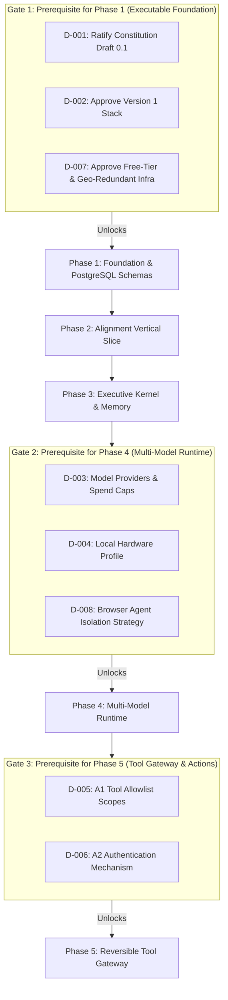

# Ratification Checklist & Decision Sign-Off

**Status:** Draft for operator review  
**Version:** Draft 0.1  
**Authority:** Derived from Constitution Article I and Implementation Plan Phase 0

---

## 1. Purpose & Gating Mechanism

This checklist formalizes the transition from **Phase 0 (Planning Baseline Complete)** to **Phase 1 (Executable Foundation)**. In accordance with [AGENTS.md Rule 2](../../AGENTS.md), no contributor or AI agent may begin runtime implementation until the operator explicitly signs off on Phase 1 blocking decisions.

Decisions are staged across development milestones so that early work is not blocked by choices that only matter in later phases.

---

## 2. Gating Decision Matrix



---

## 3. Formal Sign-Off Table

### Phase 1 Blocking Decisions (Required Immediately)

| Decision ID | Subject & Target Document | Recommended Choice | Operator Status | Signature / Date |
|---|---|---|:---:|:---:|
| **D-001** | **Ratify Constitution Draft 0.1**<br>[UNIVERSAL_BRAIN_CONSTITUTION_DRAFT.md](constitution/UNIVERSAL_BRAIN_CONSTITUTION_DRAFT.md) | Approve Articles 0 through X as binding system policy (Version 0.1.0). | **[PENDING]** | `____________________` |
| **D-002** | **Approve Version 1 Stack**<br>[SYSTEM_ARCHITECTURE.md](architecture/SYSTEM_ARCHITECTURE.md) | Python 3.12+, FastAPI, Pydantic v2, PostgreSQL 16+ with `pgvector`, Docker Compose. | **[PENDING]** | `____________________` |
| **D-007** | **Approve Geo-Redundancy & Free Tier**<br>[MEMORY_ARCHITECTURE.md](architecture/MEMORY_ARCHITECTURE.md)<br>[FREE_CLOUD_ORCHESTRATION.md](infrastructure/FREE_CLOUD_ORCHESTRATION.md) | Oracle Cloud Always Free ARM (24GB RAM) + chunked micro-batches to Google Drive + 6-hour encrypted GitHub dumps + Telegram cold sink. | **[PENDING]** | `____________________` |

---

### Phase 4 Gating Decisions (Deferred to Month 2)

| Decision ID | Subject & Target Document | Recommended Choice | Operator Status | Signature / Date |
|---|---|---|:---:|:---:|
| **D-003** | **Model Providers & Budget Limits**<br>[COST_CONTROL_POLICY.md](architecture/COST_CONTROL_POLICY.md) | Initial providers: Anthropic (Claude 3.5/Fable) + OpenAI (GPT-4o/5). $20.00/mo hard ceiling. | **[DEFERRED]** | Gated before Phase 4 |
| **D-004** | **Local Hardware Profile Confirmation**<br>[FREE_CLOUD_ORCHESTRATION.md](infrastructure/FREE_CLOUD_ORCHESTRATION.md) | Local PC (RTX 3050, 16GB RAM) confirmed as Command Center, UI, and CPU embedding worker. | **[DEFERRED]** | Gated before Phase 4 |
| **D-008** | **Browser Agent Container Isolation**<br>[BROWSER_AGENT_SPEC.md](architecture/BROWSER_AGENT_SPEC.md) | Run Playwright inside an isolated Docker container with locked network egress and sanitized output. | **[DEFERRED]** | Gated before Phase 4 |

---

### Phase 5 Gating Decisions (Deferred to Month 3)

| Decision ID | Subject & Target Document | Recommended Choice | Operator Status | Signature / Date |
|---|---|---|:---:|:---:|
| **D-005** | **A1 Tool Allowlist Scopes**<br>[ADR-0008](architecture/adr/0008-rollback-engine-specification.md) | Strict directory jail (`./workspace/`), git shadow branch sandboxes, allowlisted CLI tools. | **[DEFERRED]** | Gated before Phase 5 |
| **D-006** | **A2 Approval Authentication**<br>[EXECUTIVE_BRAIN_SPEC.md](architecture/EXECUTIVE_BRAIN_SPEC.md) | Dedicated Telegram Bot push with signed approval token + CLI confirmation fallback. | **[DEFERRED]** | Gated before Phase 5 |

---

## 4. Operator Ratification Statement

When the operator decides to unlock Phase 1 development, this section serves as the binding authority event (`ALN-003`):

```markdown
I, the Operator, hereby ratify Universal Brain Constitution Draft 0.1 and approve
decisions D-001, D-002, and D-007. Development of Phase 1 (Executable Foundation)
is authorized to proceed in accordance with AGENTS.md.

Operator Identifier: _____________________________________________
Cryptographic Key Fingerprint: ___________________________________
Date & Timestamp: ________________________________________________
```
