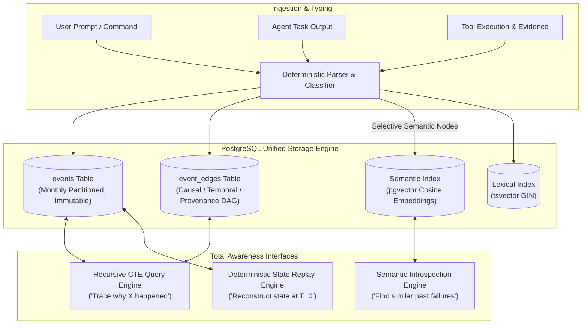
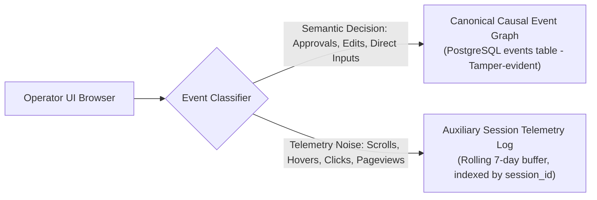

# Total Awareness Architecture: Causal Event Graph & Semantic Memory

**Status:** Draft for operator review  
**Version:** Draft 0.1  
**Authority:** Derived from Constitution Articles I, IV, V and Invariants ALN-002, ALN-016, ALN-021

---

## 1. Foundational Doctrine

A system that merely records flat logs cannot answer the question *"Why did this happen?"* It can only record that a state change occurred. 

The **Total Awareness Principle** establishes that Universal Brain must maintain a **Unified Causal Event Graph** paired with a **Semantic Vector Index**, enabling complete temporal, relational, and intentional introspection across its entire multi-year lifecycle.

At any point in time, the system can deterministically answer:
- *"What did the system do at 03:42 AM on March 15, 2028?"*
- *"Why did the router assign Project X to Claude Sonnet instead of GPT?"*
- *"Show me every modification made to `robot_controller.cpp` over the last 3 years and the requirements that prompted them."*
- *"What was the operator's exact original wording when they initialized Project Y?"*
- *"Which model introduced a hallucinated assertion, and what verification check caught it?"*



---

## 2. Canonical Governance Event Taxonomy

Every material occurrence is captured as a typed, timestamped, cryptographically linked node:

| Event Type | Category | Semantic Description | Example |
|---|---|---|---|
| `USER_INPUT` | Alignment | Raw, immutable operator utterance or message. | `"Build a ROS2 humanoid controller."` |
| `INTENT_PARSED` | Alignment | Structured requirements, constraints, and non-goals. | Parsed requirement list: `[REQ-001, REQ-002]`. |
| `CONTRACT_CREATED` | Alignment | Initial Alignment Contract instantiated (Draft v1). | Contract `ctr-8f8e02d3` created. |
| `CONTRACT_UPDATED` | Alignment | Formal amendment or operator correction applied. | Contract v2: `"Must support ROS2 Humble."` |
| `TASK_ASSIGNED` | Executive | Work package bounded and delegated to an agent role. | Task 42 delegated to `RoboticsEngineer` role. |
| `MODEL_SELECTED` | Router | Cognitive router selects a model based on capability and cost. | `claude-sonnet-4-5` leased for Task 42. |
| `MODEL_RESPONSE` | Execution | Raw output payload generated by the leased model. | Code patch and reasoning explanation. |
| `TOOL_CALLED` | Execution | Execution of an A0/A1/A2 tool through the Tool Gateway. | `file_write("robot_controller.cpp")`. |
| `EVIDENCE_PRODUCED` | Verification| Deterministic output artifact proving a state change. | Compiler output log, binary hash, screenshot. |
| `VERIFICATION_RUN` | Verification| Execution of an acceptance test suite or static analysis. | `colcon test` exited with code 0 (all passed). |
| `HALLUCINATION_CAUGHT`| Verification| Adversarial critic or test caught a hallucinated assertion. | Critic flagged non-existent ROS2 topic name. |
| `ROLLBACK_EXECUTED` | Recovery | A1 action reversed via ADR-0008 preflight or post-failure. | `git reset --hard` executed on shadow branch. |
| `HANDOFF_OCCURRED` | Executive | Executive model swap triggered due to context/health. | Leased swapped from GPT to Claude. |
| `OPERATOR_APPROVAL` | Governance | Explicit operator confirmation for an A2 action. | Cryptographic approval for production deployment. |
| `SYSTEM_FAILURE` | Resilience | Hardware, provider, database, or worker outage. | Colab GPU worker disconnected; task re-queued. |
| `CONSTITUTION_CHECK`| Governance | Periodic invariant and hash integrity validation check. | Invariant validation: ALN-001 to ALN-021 verified. |
| `CONSTITUTION_AMEND`| Governance | Ratified constitutional amendment with semantic diff. | Operator ratified Constitution Amendment 1. |
| `MEMORY_SYNC` | Storage | Chunked micro-batch or encrypted dump replication. | Chunk `events_1420_000.jsonl` pushed to Drive. |

---

## 3. PostgreSQL Native Graph Engine (No Neo4j / ClickHouse Sprawl)

To adhere to the **Modular Monolith** architecture ([AGENTS.md Rule 11](../../AGENTS.md)), Universal Brain avoids multi-database operational overhead. Standard PostgreSQL 16+ provides enterprise-grade graph traversal using **Recursive Common Table Expressions (CTEs)** and table partitioning.

### 3.1 Relational Schema

```sql
-- 1. Canonical Events Table (Partitioned by Month)
CREATE TABLE events (
    event_id UUID PRIMARY KEY DEFAULT gen_random_uuid(),
    timestamp TIMESTAMPTZ NOT NULL DEFAULT clock_timestamp(),
    event_type VARCHAR(64) NOT NULL,
    actor_id VARCHAR(128) NOT NULL,
    project_id UUID REFERENCES projects(project_id),
    task_id UUID,
    contract_version INT,
    payload JSONB NOT NULL,
    prev_event_hash CHAR(64) NOT NULL,
    event_hash CHAR(64) NOT NULL,
    embedding vector(384) -- pgvector column (selective embedding)
) PARTITION BY RANGE (timestamp);

-- 2. Causal & Temporal Edges Table
CREATE TABLE event_edges (
    edge_id UUID PRIMARY KEY DEFAULT gen_random_uuid(),
    source_event_id UUID NOT NULL,
    target_event_id UUID NOT NULL,
    relation_type VARCHAR(32) NOT NULL, -- 'CAUSED_BY', 'PROVES', 'INVALIDATES', 'SUPERSEDES'
    created_at TIMESTAMPTZ NOT NULL DEFAULT clock_timestamp(),
    FOREIGN KEY (source_event_id) REFERENCES events(event_id) ON DELETE RESTRICT,
    FOREIGN KEY (target_event_id) REFERENCES events(event_id) ON DELETE RESTRICT
);

CREATE INDEX idx_events_timestamp ON events(timestamp);
CREATE INDEX idx_events_project ON events(project_id);
CREATE INDEX idx_events_payload ON events USING gin(payload);
CREATE INDEX idx_event_edges_source ON event_edges(source_event_id);
CREATE INDEX idx_event_edges_target ON event_edges(target_event_id);
```

### 3.2 Causal Lineage Traversal (Recursive CTE Example)
When the operator asks *"Why did this tool action happen?"*, the Kernel executes a backward causal traversal:

```sql
WITH RECURSIVE causal_chain AS (
    -- Anchor: Start from the target tool execution event
    SELECT e.event_id, e.timestamp, e.event_type, e.payload, ee.source_event_id, 1 as depth
    FROM events e
    LEFT JOIN event_edges ee ON e.event_id = ee.target_event_id AND ee.relation_type = 'CAUSED_BY'
    WHERE e.event_id = 'c7a840e6-b514-41cf-9a99-4c6e3b5e40a1'

    UNION ALL

    -- Recursive Step: Walk backward along 'CAUSED_BY' edges to original user prompt
    SELECT parent.event_id, parent.timestamp, parent.event_type, parent.payload, ee.source_event_id, cc.depth + 1
    FROM events parent
    INNER JOIN causal_chain cc ON parent.event_id = cc.source_event_id
    LEFT JOIN event_edges ee ON parent.event_id = ee.target_event_id AND ee.relation_type = 'CAUSED_BY'
    WHERE cc.depth < 20 -- Safety recursion depth limit
)
SELECT depth, timestamp, event_type, payload
FROM causal_chain
ORDER BY depth DESC;
```
*Result:* Returns the unbroken causal path: `USER_INPUT` $\longrightarrow$ `INTENT_PARSED` $\longrightarrow$ `CONTRACT_CREATED` $\longrightarrow$ `TASK_ASSIGNED` $\longrightarrow$ `TOOL_CALLED`.

---

## 4. Semantic Memory & Introspection (pgvector)

To prevent embedding compute exhaustion, the Kernel applies **Selective Semantic Indexing**:
- **Indexed with Embeddings:** `USER_INPUT`, `INTENT_PARSED`, `CONTRACT_UPDATED`, `EXECUTIVE_RATIONALE`, `HALLUCINATION_CAUGHT`, and error summaries.
- **Indexed with Lexical Full-Text (`tsvector`):** Source code diffs, compiler logs, raw tool outputs, and telemetry events.

### 4.1 Natural Language Introspection Query
When an Executive Model or operator issues an introspective inquiry:
```python
# Introspective query example: "Did we ever have issues with CAN bus timeouts?"
query_embedding = embed_text("CAN bus timeout communication failure")

results = await db.execute(
    """
    SELECT event_id, timestamp, event_type, payload->>'summary' as summary,
           1 - (embedding <=> :query_embedding) AS similarity
    FROM events
    WHERE embedding IS NOT NULL
    ORDER BY embedding <=> :query_embedding
    LIMIT 5;
    """,
    {"query_embedding": query_embedding}
)
```

---

## 5. UI Telemetry Separation (Anti-Poisoning Guardrail)

To prevent 100,000+ daily mouse scrolls, clicks, and page navigations from polluting the canonical causal graph:



1. **Auxiliary Session Telemetry:** High-frequency UI interactions are written to a rolling, non-replicated 7-day session log.
2. **Context Binding on Action:** When the operator takes a consequential governance action (e.g. `OPERATOR_APPROVAL`), the canonical event captures a snapshot of active UI context (`visible_contract_id`, `viewport_diff_hash`, `session_id`) without logging intermediate cursor movements.

---

## 6. Deterministic State Replay Protocol

The Total Awareness architecture guarantees that the entire state of the system can be reconstructed at any historic timestamp $T$:

1. **Base Snapshot:** Restore the nearest encrypted database snapshot created before timestamp $T$.
2. **Chronological Event Replay:** Replay events from `events` where `timestamp <= T`, recalculating task states, project ledgers, and contract versions.
3. **Audit Verification:** Verify that the Merkle root of the replayed state matches the historical hash recorded in the audit log.

---

## 7. Privacy Scrubbing & Data Redaction

While constitutional decisions and code provenance are permanent, personal identifying information (PII) or accidentally leaked credentials must be scrubbable:
- **Redaction Tombstones:** When an operator commands a redaction (`REDACT_EVENT_FIELD(event_id, field_path)`), the sensitive payload value is replaced with a cryptographic tombstone: `"[REDACTED_BY_OPERATOR: SHA256_HASH]"`.
- **Integrity Preservation:** The event metadata, causal edges, and cryptographic hash chain remain intact, proving the event existed without exposing the scrubbed data.
