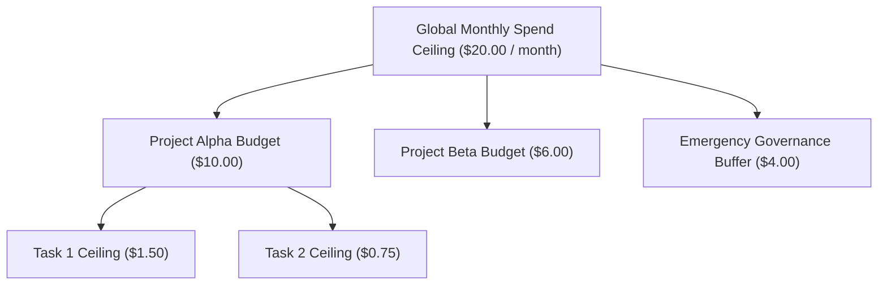
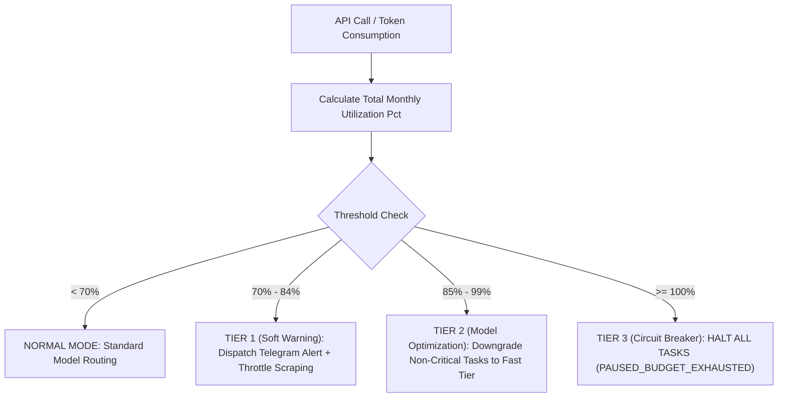

# Cost Control Policy & Budget Exhaustion Algorithm

**Status:** Draft for operator review  
**Version:** Draft 0.1  
**Authority:** Derived from Constitution Article VIII (Resilience and Failure) and Invariants ALN-014, REQ-STA-006

---

## 1. Governing Philosophy

An autonomous executive AI system operating over a 2-year horizon without hard, deterministic budget constraints will inevitably experience runaway costs due to infinite retry loops, context bloat, or rogue agent spawning.

The **Universal Brain Cost Control Policy** guarantees that financial expenditure is mathematically bounded. Every token consumed, API call made, and compute hour billed is tracked in real-time within the Executive Kernel.

---

## 2. Budget Allocation Structure

Budgets are hierarchical and strictly enforced by the Kernel's Budget Gatekeeper:



### 2.1 Standard Allocation Defaults

| Level | Default Ceiling | Hard Limit Behavior | Override Authority |
|---|---|---|---|
| **Global Monthly** | **$20.00 USD / month** | System enters `PAUSED_BUDGET_EXHAUSTED` mode. | Operator only (`INCREASE_BUDGET`) |
| **Per Project** | **$5.00 – $15.00 USD** | Project enters `BLOCKED_BUDGET` state. | Operator or Executive proposal |
| **Per Task (Single Run)** | **$1.00 USD** | Task lease revoked; rollback triggered if unverified. | Executive Kernel rule |
| **Per-Turn Context Cap** | **5,000 tokens (EAP)** | Dynamic context pruning active. | Hardcoded Kernel invariant |

---

## 3. The 3-Tier Budget Exhaustion Algorithm

The Budget Gatekeeper evaluates total spend on every state change and model inference turn:



### Tier 1: Soft Warning Threshold (70% of Monthly Ceiling)
- **Trigger:** Cumulative spend reaches **70%** (e.g. $14.00 of $20.00).
- **Enforcement Actions:**
  1. Dispatches an out-of-band push alert via the **Telegram Bot**:  
     *`⚠️ Universal Brain Budget Notice: 70% ($14.00) of monthly ceiling consumed. 14 days remaining in cycle.`*
  2. Low-priority background web scraping tasks are throttled (rate-limited by 50%).
  3. No task interruption occurs.

### Tier 2: Model Downgrade & Autonomous Optimization (85% of Monthly Ceiling)
- **Trigger:** Cumulative spend reaches **85%** (e.g. $17.00 of $20.00).
- **Enforcement Actions:**
  1. The Cognitive Router automatically switches routing profiles:
     - **Frontier Reasoning Models** (e.g. Claude 3.5 Sonnet, GPT-4o) are restricted strictly to high-leverage architectural decomposition and final verification critiques.
     - **Routine Tasks** (code formatting, simple refactors, documentation summaries, data extraction) are automatically downgraded to **Fast/Free Tiers** (e.g. Gemini 1.5 Flash, Claude 3.5 Haiku, or local CPU models).
  2. High-impact ambiguity threshold is lowered: tasks with ambiguous requirements are halted rather than explored autonomously.
  3. Dispatches Telegram Alert:  
     *`🟡 Universal Brain Budget Warning: 85% ($17.00) consumed. Automatic model tier downgrade active.`*

### Tier 3: Hard Circuit Breaker (100% of Monthly Ceiling)
- **Trigger:** Cumulative spend reaches **100%** (e.g. $20.00 of $20.00).
- **Enforcement Actions (Fail-Closed):**
  1. **Immediate Execution Halt:** All active state-changing tasks (A1/A2) across all projects are frozen and placed into `PAUSED_BUDGET_EXHAUSTED`.
  2. **Read-Only Lockout:** Only read-only operations (A0 inspection, status checks) and operator commands are permitted.
  3. **No Automatic Inferences:** The Kernel stops issuing outbound model API calls.
  4. Dispatches High-Priority Telegram Alert:  
     *`🔴 CRITICAL: Monthly budget ceiling (100% - $20.00) reached. All autonomous work paused. Issue INCREASE_BUDGET command or await billing reset.`*

---

## 4. Token Metering & Real-Time Cost Formula

Costs are calculated on every response payload using the Model Registry's verified pricing table:

$$\text{Task Cost (USD)} = \left(\frac{\text{Prompt Tokens}}{1000} \times \text{Price}_{\text{in}}\right) + \left(\frac{\text{Completion Tokens}}{1000} \times \text{Price}_{\text{out}}\right) + \text{Tool Compute Cost}$$

### 4.1 Transactional Accounting
Every expenditure generates a record in the `budget_transactions` table inside PostgreSQL:

```sql
CREATE TABLE budget_transactions (
    transaction_id UUID PRIMARY KEY DEFAULT gen_random_uuid(),
    timestamp TIMESTAMPTZ NOT NULL DEFAULT clock_timestamp(),
    project_id UUID REFERENCES projects(project_id),
    task_id UUID,
    model_id VARCHAR(64) NOT NULL,
    prompt_tokens INT NOT NULL,
    completion_tokens INT NOT NULL,
    cost_usd NUMERIC(8, 6) NOT NULL,
    cumulative_monthly_usd NUMERIC(8, 2) NOT NULL
);
```

If an API provider's usage reporting disagrees with local token estimates, the Kernel defaults to the **higher value** for safety calculations until the provider invoice reconciles.
