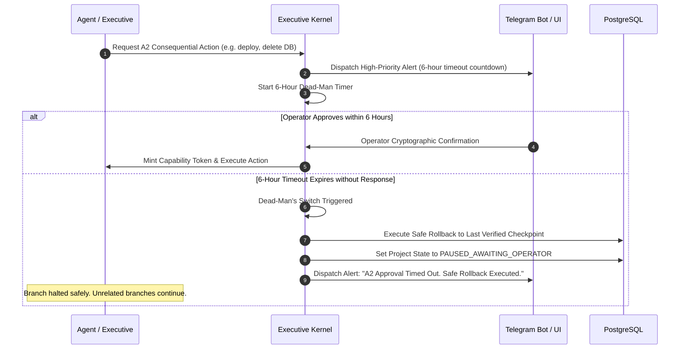
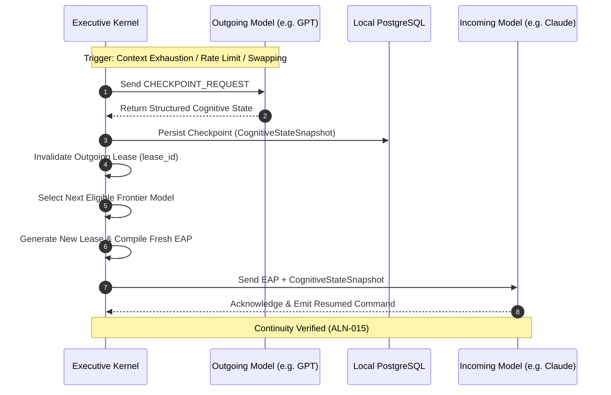

# Universal Executive Brain Specification

**Status:** Draft for operator review  
**Version:** Draft 0.1  
**Authority:** Derived from Universal Brain Constitution Article VI and Invariants ALN-008, ALN-014, ALN-015, ALN-016

---

## 1. Architectural Philosophy: The Decoupled Brain

The core architectural problem of autonomous systems is: *"Which AI permanently sits at the top?"*  
The Universal Brain answer is: **No LLM permanently sits at the top.**

The Universal Executive Brain (UEB) is structured into two decoupled, cooperating layers:

```mermaid
flowchart TD
    subgraph Kernel ["Executive Kernel (Sovereign Core - Deterministic)"]
        K1["Canonical State & Ledger (PostgreSQL)"]
        K2["Permission & Capability Engine"]
        K3["Health, Audit & Budget Monitor"]
        K4["State Machine & Lease Controller"]
    end

    subgraph Intelligence ["Executive Model (Intelligence Layer - Ephemeral)"]
        M1["Frontier LLM (GPT / Claude / Gemini)"]
        M2["Reasoning & Planning Engine"]
        M3["Natural Language Synthesizer"]
    end

    K1 -->|Executive Awareness Package (EAP)| M1
    M1 -->|Typed Action Commands| K2
    K2 -->|Validated State Transitions| K1
    K3 -->|Lease / Health Signals| K4
    K4 -->|Checkpoint / Handoff Trigger| Intelligence
```

### 1.1 Executive Kernel (Sovereign Core)
- **Nature:** Primarily deterministic software (PostgreSQL, state machines, schedulers, hash chains).
- **Responsibilities:** Identity, Canonical Goals, Constraints, Active Permissions, World State, Evidence Indexes, Decision History, Resource Budgets, and Model Registry.
- **Authority:** Owns the sole canonical truth. It is permanent, persistent, local-first, and provider-neutral.

### 1.2 Executive Model (Intelligence Layer)
- **Nature:** A dynamically leased frontier AI reasoning model (e.g., GPT, Claude, Gemini).
- **Responsibilities:** Comprehending unstructured user intent, semantic planning, task decomposition, agent delegation, and communicating coherent results to the operator.
- **Constraint:** Holds an ephemeral reasoning lease. It cannot write directly to canonical state, grant permissions, or bypass verification gates. It can only propose state transitions via typed, validated commands.

---

## 2. Executive Awareness Package (EAP) Protocol

The Kernel injects a structured, minimized, and classified context package into the Executive Model's context window on every turn. The model does not query arbitrary raw databases; it consumes the EAP.

### 2.1 EAP Context Pruning & Pagination Limits

To prevent context bloat and explosive API costs over extended projects, the EAP is strictly bounded:

| Category | Hard Limit | Pruning & Selection Behavior |
|---|---|---|
| `active_projects` | Top 5 | Only the 5 most recently active projects are injected. Additional projects require `INSPECT_SYSTEM`. |
| `active_agents` | Top 10 | Only agents that have reported a heartbeat or executed tasks within the last 60 minutes. |
| `pending_decisions` | Top 3 | The 3 most urgent decisions (nearest deadline or highest impact). |
| `recent_critical_events`| Last 10 | Only the 10 most recent system events. Full history is preserved in the audit log. |
| `available_models` | All | Registry profiles for eligible models (dozens, lightweight). |
| `budgets` | All | Full token, API cost, and compute utilization metrics are always included. |

- **Deep Telemetry Inspection:** If the Executive Model needs historical context, it issues `INSPECT_SYSTEM(target_type="project", target_id=..., depth=2)`. The Kernel returns the requested slice as a single-turn payload.
- **Dynamic Context Ceiling:** If the computed EAP exceeds **5,000 tokens** (measured via tokenizer), the Kernel automatically prunes completed sub-tasks and prepends a notice:  
  *`[NOTICE: EAP dynamic ceiling reached (5,000 tokens). Low-priority summaries truncated. Issue INSPECT_SYSTEM for full details.]`*

### 2.2 EAP JSON Schema

```json
{
  "$schema": "https://json-schema.org/draft/2020-12/schema",
  "title": "ExecutiveAwarenessPackage",
  "type": "object",
  "required": [
    "session_context",
    "constitutional_boundaries",
    "system_health",
    "budgets",
    "active_projects",
    "active_agents",
    "pending_decisions",
    "recent_critical_events"
  ],
  "properties": {
    "session_context": {
      "type": "object",
      "required": ["system_id", "operator_id", "session_id", "lease_id", "timestamp"],
      "properties": {
        "system_id": { "type": "string" },
        "operator_id": { "type": "string" },
        "session_id": { "type": "string", "format": "uuid" },
        "lease_id": { "type": "string", "format": "uuid" },
        "contract_version": { "type": "integer" },
        "timestamp": { "type": "string", "format": "date-time" }
      }
    },
    "constitutional_boundaries": {
      "type": "object",
      "required": ["action_ceiling", "prohibited_actions", "active_invariants"],
      "properties": {
        "action_ceiling": { "type": "string", "enum": ["A0", "A1", "A2"] },
        "prohibited_actions": { "type": "array", "items": { "type": "string" } },
        "active_invariants": { "type": "array", "items": { "type": "string" } }
      }
    },
    "system_health": {
      "type": "object",
      "required": ["overall_status", "audit_service_healthy", "verification_service_healthy", "database_healthy"],
      "properties": {
        "overall_status": { "type": "string", "enum": ["HEALTHY", "DEGRADED", "SAFE_STOP"] },
        "audit_service_healthy": { "type": "boolean" },
        "verification_service_healthy": { "type": "boolean" },
        "database_healthy": { "type": "boolean" }
      }
    },
    "budgets": {
      "type": "object",
      "required": ["api_cost_used_usd", "api_cost_ceiling_usd", "compute_seconds_used", "compute_seconds_ceiling"],
      "properties": {
        "api_cost_used_usd": { "type": "number" },
        "api_cost_ceiling_usd": { "type": "number" },
        "compute_seconds_used": { "type": "integer" },
        "compute_seconds_ceiling": { "type": "integer" }
      }
    },
    "available_models": {
      "type": "array",
      "items": {
        "type": "object",
        "required": ["model_id", "family", "tier", "status"],
        "properties": {
          "model_id": { "type": "string" },
          "family": { "type": "string" },
          "tier": { "type": "string", "enum": ["frontier_reasoning", "fast_exec", "local_cpu", "browser_harvest"] },
          "status": { "type": "string", "enum": ["AVAILABLE", "RATE_LIMITED", "OFFLINE"] }
        }
      }
    },
    "active_projects": { "type": "array", "maxItems": 5, "items": { "type": "object" } },
    "active_agents": { "type": "array", "maxItems": 10, "items": { "type": "object" } },
    "pending_decisions": { "type": "array", "maxItems": 3, "items": { "type": "object" } },
    "recent_critical_events": { "type": "array", "maxItems": 10, "items": { "type": "object" } }
  }
}
```

---

## 3. Executive Action Commands & Wire Protocol

The Executive Model cannot execute commands arbitrarily. It communicates through a strict wire protocol validated by the deterministic Kernel.

### 3.1 Command Wire Protocol
- **Primary Wire:** Native tool/function calling (OpenAI function calling, Anthropic tool use) enforced via JSON Schema.
- **Fallback Wire:** Embedded JSON-RPC 2.0 payload within model output.

### 3.2 Command Registry

| Command | Signature & Parameters | Description & Gating Rule |
|---|---|---|
| `CREATE_PROJECT` | `(title: str, objective: str, original_input_id: UUID, initial_requirements: List[str])` | Instantiates a project entity and generates Draft Alignment Contract version 1. |
| `UPDATE_CONTRACT` | `(contract_id: UUID, semantic_diff: str, updated_fields: dict, rationale: str)` | Increments contract version. Historical versions are preserved. Requires authority event. |
| `ASSIGN_TASK` | `(project_id: UUID, requirement_ids: List[str], role: str, model_id: str, tool_scope: List[str], action_ceiling: str, acceptance_criteria: List[str])` | Binds an ephemeral model to an agent role for a bounded task with an explicit capability lease. |
| `REQUEST_CLARIFICATION`| `(ambiguity_id: str, question: str, impact: "low"\|"medium"\|"high", affected_branches: List[str])` | Asks operator for resolution. If `impact == "high"`, the affected execution branch is immediately locked. |
| `INSPECT_SYSTEM` | `(target_type: "project"\|"agent"\|"audit"\|"tool", target_id: UUID, depth: int)` | Requests deeper telemetry beyond the standard EAP summary. |
| `REVOKE_LEASE` | `(lease_id: UUID, rollback: bool, reason: str)` | Immediately revokes an agent/model capability token. Executes rollback if requested. |
| `DECLARE_COMPLETE` | `(task_id: UUID, evidence_refs: List[str], summary: str)` | Proposes completion to the Verification Engine. The model cannot mark the task verified itself. |
| `PAUSE` | `(scope: "all"\|"project"\|"agent", target_id: Optional[UUID], reason: str)` | Pauses work and puts active workers into an idle wait state. |
| `RESUME` | `(target_id: UUID, revalidate_contract: bool)` | Revalidates contract version and permissions, then resumes paused work. |
| `CANCEL` | `(project_id: UUID, reason: str)` | Terminates active tasks and archives the project state. |

### 3.3 Command Validation & The Error-Retry Loop
- **Retry Limit:** The Executive Model has a maximum of **3 consecutive correction attempts** for a single turn.
- **Fail-Safe Handoff:** If all 3 attempts fail, the Kernel terminates the model lease, records a failure event, and initiates a cognitive handoff to an alternative frontier model.
- **Safe Degraded Fallback:** If secondary models also fail validation, the Kernel halts state changes, enters `SAFE_DEGRADED` mode, and pages the operator.

### 3.4 A2 Approval Timeout & Dead-Man's Fallback Protocol

To prevent projects from stalling indefinitely when an operator is unreachable (e.g., traveling without internet):



1. **The 6-Hour Response Window:** When an A2 action is proposed, an urgent notification is dispatched to the operator via local UI and Telegram Bot with a 6-hour expiration deadline.
2. **Deterministic Safe Rollback:** If no authenticated response is received within 6 hours, the Kernel automatically executes an ADR-0008 **Safe Rollback**, reverting the affected task branch to the last verified checkpoint and placing the branch into `PAUSED_AWAITING_OPERATOR`.
3. **A1 Alternative Exploration:** For non-critical A2 actions (e.g. requesting permission to install an external binary), the Executive Model is permitted to search for a safe A1 alternative (e.g. using a pre-installed standard library) while the primary branch remains paused.
4. **Constitutional Invariant:** The system **NEVER** simulates, infers, or assumes operator consent under any circumstances. Silence is always treated as `DENY`.

---

## 4. Cognitive Handoff & Continuity Protocol

When an Executive Model reaches context capacity, suffers provider outages, or is swapped for a different model family, the Kernel executes a zero-data-loss cognitive handoff:



### 4.1 Cognitive State Checkpoint Schema
The checkpoint captures reasoning state in a model-neutral representation:

```json
{
  "checkpoint_id": "c7a840e6-b514-41cf-9a99-4c6e3b5e40a1",
  "project_id": "8f8e02d3-189f-4318-971c-0e890c0b8934",
  "contract_version": 2,
  "conversation_summary": "Synthesized summary of operator discussion and intent up to step 42.",
  "active_goal_tree": {
    "primary_goal": "Implement ROS2 Navigation Controller",
    "completed_subgoals": ["Define message structures", "Implement PID loop"],
    "active_subgoal": "Write Gazebo launch file and configure parameters"
  },
  "open_assumptions": [
    {
      "assumption_id": "ASM-004",
      "statement": "Defaulting to ROS 2 Humble distribution on Ubuntu 22.04 LTS.",
      "impact": "low",
      "rollback_path": "Re-run colcon build in ROS 2 Iron container."
    }
  ],
  "unresolved_ambiguities": [],
  "next_planned_actions": [
    "Verify node compiles with colcon build --symlink-install",
    "Run unit tests with colcon test"
  ]
}
```

### 4.2 Recovery Invariants
1. **ALN-015 (Recovery Gate):** The incoming Executive Model cannot execute commands until the Kernel re-verifies that the active contract version, capability token, and idempotency keys match the checkpoint.
2. **ALN-014 (Safe Degradation):** If no eligible frontier model is available or healthy, the Kernel enters `SAFE_DEGRADED` mode: all state-changing actions are paused, work leases are held, and the operator is notified.
