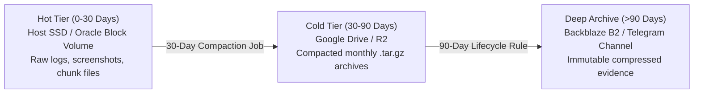
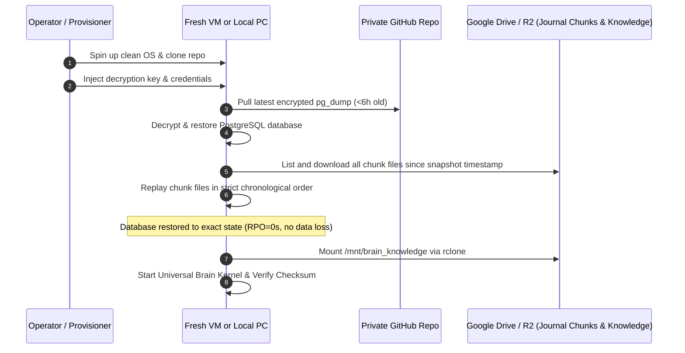

# Memory System & Geo-Redundant Storage Architecture

**Status:** Draft for operator review  
**Version:** Draft 0.1  
**Authority:** Derived from Constitution Article V (State, Memory, and Privacy) and Invariants ALN-012, ALN-016

---

## 1. Problem Statement: Resolving the Single Point of Failure (SPOF)

The legacy JARVIS architecture utilized a 4-stage pipeline:
$$\text{Short-Term Cache} \longrightarrow \text{Long-Term PostgreSQL} \longrightarrow \text{Vector Store (ChromaDB/FAISS)} \longrightarrow \text{Knowledge Base}$$

**The Fatal Failure Mode:** When running on free-tier cloud instances (such as an Oracle Cloud Always Free VM), an instance termination, disk corruption, or cloud reclaim completely wipes the local PostgreSQL data directory and ChromaDB binary index. Without off-site synchronization, the Brain experiences permanent catastrophic amnesia.

To resolve this without recurring enterprise database costs, Universal Brain implements a **4-Tier Geo-Redundant Memory Architecture** with a Recovery Point Objective (RPO) of **0 seconds** and Recovery Time Objective (RTO) of **<15 minutes**.

---

## 2. The 4-Tier Geo-Redundant Topology

```mermaid
flowchart TD
    subgraph Host ["Host Instance (Oracle Cloud Always Free / Local PC)"]
        T0["Tier 0: Ephemeral Working Memory (RAM / Process Context)"]
        T1_DB[("Tier 1: Structured Truth (PostgreSQL)")]
        Daemon["Memory Replicator Background Daemon"]
        T2_VEC["Tier 2: Vectors stored as JSONB / pgvector in PostgreSQL"]
        Mount["rclone FUSE Mount Point (/mnt/brain_knowledge)"]
    end

    subgraph Offsite_Sync ["Off-Site Real-Time & Snapshot Redundancy"]
        GDrive_Journal["Google Drive / R2: Chunked Micro-Batches (/journal/YYYY-MM-DD/HH/events_*.jsonl)"]
        GitHub_Repo["Private GitHub Repository: Encrypted pg_dump (Every 6h)"]
        GDrive_Raw["Google Drive / HuggingFace: Raw Knowledge, PDFs & Weights"]
        Telegram_Cold["Private Telegram Archive Channel: Tertiary Gzipped Cold Storage"]
    end

    T0 <-->|Query / Commit| T1_DB
    T1_DB <-->|Embeddings Co-located| T2_VEC
    T1_DB -->|WAL / Transactional Event Trigger| Daemon
    Daemon -->|Chunked 60s Micro-Batches| GDrive_Journal
    Daemon -->|6-Hour Encrypted Dump| GitHub_Repo
    Daemon -->|Monthly Compactions (>30d)| Telegram_Cold
    Mount <-->|Persistent Virtual FS| GDrive_Raw
```

---

## 3. Tier Specifications

### Tier 0: Ephemeral Working Memory (RAM)
- **Nature:** High-speed, volatile in-process context.
- **Contents:** Active conversation turns, uncommitted scratchpad reasoning, cached EAP payloads, and transient tool execution outputs.
- **Durability:** Volatile. If the host restarts, Tier 0 is discarded and reconstructed deterministically from Tier 1.

### Tier 1: Structured Truth (PostgreSQL)
- **Nature:** The authoritative relational store.
- **Contents:** Projects, tasks, agent roles, capability leases, alignment contracts, requirements ledger, assumption register, ambiguity ledger, and the tamper-evident hash-linked audit log.
- **Redundancy Mechanism:**
  1. **Real-Time Event Journaling (Chunked Micro-Batches):**
     - The `memory_replicator` daemon does **not** append to a single remote file (which would cause API rate limits and file locking on Google Drive).
     - Instead, the daemon buffers events in local memory for up to **60 seconds or 100 events** (whichever comes first).
     - It then writes an immutable chunk file: `journal/YYYY-MM-DD/HH/events_HHMM_000.jsonl` (one file per minute).
     - **Alternative Fallback (Recommended):** Use Cloudflare R2 (10GB free tier, S3-compatible, zero egress fees) or GitHub Gist API (`POST /gists/{gist_id}/comments`) for atomic real-time streaming.
     - **Rate Limit Protection:** If cloud storage returns HTTP 429 (Too Many Requests), the daemon applies exponential backoff with jitter (1s, 2s, 4s, 8s...). Events are buffered locally in SQLite/PostgreSQL and never discarded until cloud acknowledgment is received.
  2. **Periodic Encrypted Snapshots (Every 6 Hours):**
     - A background chron-job runs `pg_dump --clean --if-exists`, encrypts the payload using GPG/Age with the operator's public key, and pushes the snapshot to a private, access-controlled GitHub repository.

### Tier 2: Semantic Memory (Vector Store)
- **Anti-Pattern Avoided:** We do **not** back up opaque, brittle binary vector store files (e.g., raw SQLite/Chroma binary folders), which are prone to corruption during sudden shutdowns.
- **Universal Brain Strategy:**
  - Raw textual documents are stored in Tier 3.
  - Text chunk metadata and computed vector embeddings (e.g., 384-dimensional vectors from `all-MiniLM-L6-v2`) are stored **directly inside PostgreSQL** as `pgvector` columns or structured `JSONB`.
  - Vectors automatically travel with the 6-hour encrypted database snapshot.
  - If the vector index is ever desynchronized or missing, the Kernel re-embeds source documents locally using CPU in ~10 minutes upon cold boot.

### Tier 3: Raw Knowledge Base
- **Nature:** Bulk immutable knowledge files (architecture documents, scientific papers, code repos, model weights).
- **Storage Location:** Google Drive or Hugging Face Dataset cache.
- **Mounting Mechanism:** The host machine mounts this cloud storage bucket at system boot using `rclone` with VFS cache mode. The Brain treats it as a local directory (`/mnt/brain_knowledge`), but zero critical data lives solely on the local drive.

---

## 4. The Memory Replicator Daemon

The `memory_replicator` is a lightweight Python system daemon that runs alongside the Executive Kernel. It operates as an asynchronous worker subscribing to the PostgreSQL Transactional Outbox.

### 4.1 Replication Loop Logic

```python
# Conceptual Daemon Loop (Chunked Micro-Batches Specification)

async def run_memory_replicator():
    """
    Subscribes to the internal event bus to guarantee off-site persistence.
    Satisfies Invariants ALN-012 (Provider Independence) and ALN-016 (Audit Chain).
    """
    last_snapshot_time = time.monotonic()
    last_flush_time = time.monotonic()
    SNAPSHOT_INTERVAL = 6 * 3600  # 6 Hours
    CHUNK_FLUSH_INTERVAL = 60      # 60 Seconds
    MAX_BATCH_SIZE = 100

    buffer = []

    while True:
        # Step 1: Drain pending events from transactional outbox
        new_events = await db.fetch_pending_audit_events(limit=MAX_BATCH_SIZE)
        buffer.extend(new_events)

        elapsed = time.monotonic() - last_flush_time
        if (len(buffer) >= MAX_BATCH_SIZE or elapsed >= CHUNK_FLUSH_INTERVAL) and buffer:
            # Step 2: Flush as a unique minute-chunk file to avoid file-locking
            chunk_filename = generate_chunk_filename()  # e.g., events_1420_000.jsonl
            success = await cloud_storage.upload_chunk_with_retry(chunk_filename, buffer)
            if success:
                await db.mark_events_synced([e.id for e in buffer])
                buffer.clear()
                last_flush_time = time.monotonic()

        # Step 3: Checkpoint trigger for full snapshot
        if time.monotonic() - last_snapshot_time > SNAPSHOT_INTERVAL:
            await execute_encrypted_git_backup()
            last_snapshot_time = time.monotonic()

        await asyncio.sleep(1)
```

---

## 5. Storage Lifecycle Management & Retention Policy

To prevent the **"Storage Apocalypse"** over the 2-year lifecycle (where thousands of browser evidence screenshots and gigabytes of journal logs fill up the host drive and crash PostgreSQL), the system enforces strict tier aging:



### 5.1 Retention Rules by Asset Class

| Asset Class | Hot Tier (Host Local) | Cold Tier (Cloud Drive / R2) | Deep Archive (Telegram / B2) |
|---|---|---|---|
| **Audit Logs & State Events** | Last 30 days active in PostgreSQL & raw chunk files. | 30–90 days compacted into monthly `.tar.gz` archives. | >90 days uploaded to private Telegram archive channel / B2 cold storage. |
| **Browser Screenshots (Evidence)**| Last 14 days stored locally in `/artifacts/evidence/`. | 14–60 days stored compressed on Google Drive. | >60 days pushed to Telegram channel / B2; local stub retained. |
| **Ephemeral Worker Checkpoints** | Retained during active task execution only. | Deleted immediately upon successful task completion. | Never archived (purely ephemeral). |
| **Git Shadow Branches** | Last 10 rollback points active per project. | Squashed into patch files after task verification. | Committed to main repository history. |

### 5.2 Storage Warning Gate & Emergency Pause
- **80% Disk Capacity Threshold:** If host disk utilization crosses **80%**, the Kernel:
  1. Triggers an out-of-band **HIGH PRIORITY ALERT** to the operator via Telegram.
  2. Executes an automatic background compaction and pushes eligible archives to Telegram/B2.
- **90% Disk Capacity Threshold (Fail-Closed):** If disk utilization reaches **90%**, the Kernel immediately **pauses all new A1 and A2 actions** across all projects to prevent database write corruption. Read-only actions (A0) remain operational.

---

## 6. Cold-Boot Disaster Recovery Runbook

If the host cloud VM (e.g., Oracle Cloud) is deleted or destroyed without warning, follow this deterministic recovery procedure:



### 6.1 Recovery Commands (Reference)
1. **Restore Snapshot:**
   ```bash
   gpg --decrypt brain_backup_latest.sql.gpg | psql -U postgres -d universal_brain
   ```
2. **Replay Delta Chunks:**
   ```bash
   python -m universal_brain.kernel.recovery --chunks-dir /path/to/journal/ --since-last-wal
   ```
3. **Mount Knowledge:**
   ```bash
   rclone mount gdrive:brain_knowledge /mnt/brain_knowledge --daemon --vfs-cache-mode writes
   ```
4. **Integrity Verification:**
   The recovery tool runs validation scripts against `ALN-016` (hash chain continuity) and `ALN-020` (verification aggregation), asserting zero missing events before unlocking the Tool Gateway.
