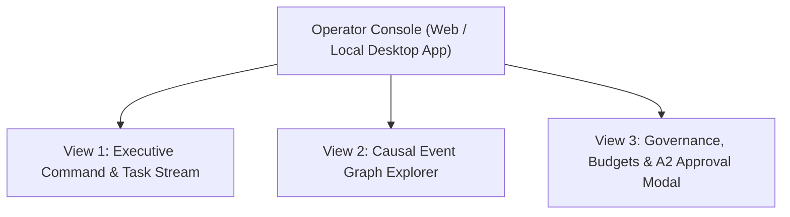

# Operator Console Specification: UI Layout, Wireframes & Interaction Design

**Status:** Draft for operator review  
**Version:** Draft 0.1  
**Authority:** Derived from Platform Requirements REQ-OPS-001, REQ-OPS-002 and Constitution Article IV (Transparency)

---

## 1. Purpose & User Experience Goals

The **Operator Console** is the primary visual interface between the human operator and the Universal Brain. It must satisfy the core constitutional mandate of transparency:
> **At any glance, the operator must know: What is the system doing, why is it doing it, under what authority, and what evidence proves it?**

The Console is built as a lightweight, local-first **React / TypeScript Single Page Application (SPA)** communicating with the Executive Kernel over an authenticated local WebSocket and REST API.

---

## 2. Information Architecture & Navigation

The Console is organized into three primary operational views:



---

## 3. UI Wireframes & Layout Design

### View 1: Executive Command & Task Stream (Main Dashboard)

```
+---------------------------------------------------------------------------------------------------+
|  UNIVERSAL BRAIN | Project: [ Humanoid Robot Controller v ] | Health: [● HEALTHY] | Spend: $12.40 |
+------------------------------------+-------------------------------------+------------------------+
| 1. CONVERSATION STREAM             | 2. REAL-TIME TASK DAG & TIMELINE    | 3. SYSTEM TELEMETRY    |
+------------------------------------+-------------------------------------+------------------------+
| [Operator @ 14:10]                 | Active Phase: Phase 2 (Compiling)   | Executive Model:       |
| "Build a ROS 2 node for PID."      |                                     | Claude 3.5 Sonnet      |
|                                    | [1. Parse Intent] -> [DONE]         | Lease: Valid (28m left)|
| [Executive @ 14:10]                |   └─ Evidence: #ev-8902             |                        |
| "Alignment Contract v1 active.     | [2. Generate Node] -> [DONE]        | Active Agents: 3       |
| Requirements: REQ-001, REQ-002.    |   └─ Agent: Coder (GPT-4o)          | - Architect (Idle)     |
| Delegated task to Robotics Coder." | [3. Preflight Rollback] -> [DONE]   | - Coder (Running)      |
|                                    |   └─ patch -R --dry-run: PASS       | - Verifier (Waiting)   |
| [Coder Agent Output: Streaming...] | [4. Colcon Build] -> [RUNNING 70%]  |                        |
| writing /src/pid_controller.cpp... |   └─ Ephemeral Worker: Colab T4     | Budgets:               |
|                                    |                                     | API Spend: $12.40/20.00|
|                                    |                                     | Storage: 38GB / 200GB  |
|                                    |                                     | EAP Size: 1,840 tokens |
+------------------------------------+-------------------------------------+------------------------+
| > Enter command or prompt...                                          [ Send ] [ Pause Project ]  |
+---------------------------------------------------------------------------------------------------+
```

---

### View 2: Causal Event Graph Explorer (Total Awareness Navigator)

An interactive visual DAG (powered by React Flow or Cytoscape.js) that visualizes historical causality:

```
+---------------------------------------------------------------------------------------------------+
|  EVENT GRAPH EXPLORER | Time Range: [ Last 7 Days v ] | Filter: [ Causal Path Only v ]            |
+---------------------------------------------------------------------------------------------------+
|                                                                                                   |
|    (USER_INPUT: "Build ROS2 node")                                                                |
|           |                                                                                       |
|           v [CAUSED_BY]                                                                           |
|    (CONTRACT_CREATED: ctr-8f8e02d3) ───────────────> (ASSUMPTION_RECORDED: "Use Humble")        |
|           |                                                                                       |
|           v [CAUSED_BY]                                                                           |
|    (TASK_ASSIGNED: Task-42 -> Coder)                                                              |
|           |                                                                                       |
|           v [CAUSED_BY]                                                                           |
|    (TOOL_CALLED: file_write "pid.cpp") ──[PROVES]──> (EVIDENCE: SHA256 / Diff / Test log)        |
|                                                                                                   |
+---------------------------------------------------------------------------------------------------+
| SELECTED EVENT DETAILS: #ev-tool-9912                                                             |
| - Type: TOOL_CALLED | Actor: CoderAgent | Timestamp: 2026-09-02 14:12:05 UTC                      |
| - Invariant Check: ALN-007 (Preflight Rollback Passed in 45ms)                                    |
| - Cryptographic Hash: e3b0c44298fc1c149afbf4c8996fb92427ae41e4649b934ca495991b7852b855             |
| [ View Diff ]  [ View Evidence Video (.webm) ]  [ Trace Parent Intent ]                           |
+---------------------------------------------------------------------------------------------------+
```

---

### View 3: A2 Consequential Action Approval Modal

Pops up immediately when an agent requests a consequential state change:

```
+-----------------------------------------------------------------------------------+
| ⚠️ ACTION APPROVAL REQUIRED (Action Class: A2 Consequential)                      |
+-----------------------------------------------------------------------------------+
| Task: Deploy ROS 2 Controller to Physical Hardware Testbed                        |
| Initiated By: Universal Executive (on behalf of Project Alpha)                    |
| Expiration Countdown: [ 05h : 42m : 18s ] (Dead-man's switch will Safe-Rollback)   |
+-----------------------------------------------------------------------------------+
| PROPOSED ACTION SPECIFICATION:                                                    |
| - Target System: `/dev/ttyUSB0` (CAN Bus Transceiver)                             |
| - Command: `ros2 launch humanoid_bringup physical.launch.py`                      |
| - Authority Requirement Cited: `REQ-TOL-004`                                      |
| - Pre-State Hash: a1b2c3d4...                                                     |
| - Rollback Strategy: Immediate SIGINT + relay power disconnect switch             |
+-----------------------------------------------------------------------------------+
| EVIDENCE REVIEW:                                                                  |
| [✔] Compiles cleanly with zero warnings (colcon build log #ev-4101)                |
| [✔] 100% unit test pass rate (14/14 tests passed)                                 |
| [✔] Gazebo headless physics simulation ran for 300s with zero collisions          |
+-----------------------------------------------------------------------------------+
| [ Reject & Roll Back Branch ]                          [ APPROVE & SIGN (Key) ]   |
+-----------------------------------------------------------------------------------+
```

---

## 4. Telemetry Binding & Event Quarantine

To adhere to the **Anti-Poisoning Guardrail** defined in [TOTAL_AWARENESS.md](TOTAL_AWARENESS.md):
1. **Client-Side Session Buffer:** Mouse clicks, scroll depths, window resizing, and tab navigations are stored purely in client-side memory and written to a rotating 7-day auxiliary log (`auxiliary_ui_telemetry`).
2. **Canonical Governance Events:** Only deliberate operator commands emit canonical events into the Causal Event Graph:
   - Clicking `[ APPROVE & SIGN ]` $\longrightarrow$ `OPERATOR_APPROVAL`
   - Submitting a prompt $\longrightarrow$ `USER_INPUT`
   - Clicking `[ Pause Project ]` $\longrightarrow$ `OPERATOR_PAUSE`
   - Amending a requirement $\longrightarrow$ `CONTRACT_UPDATED`
