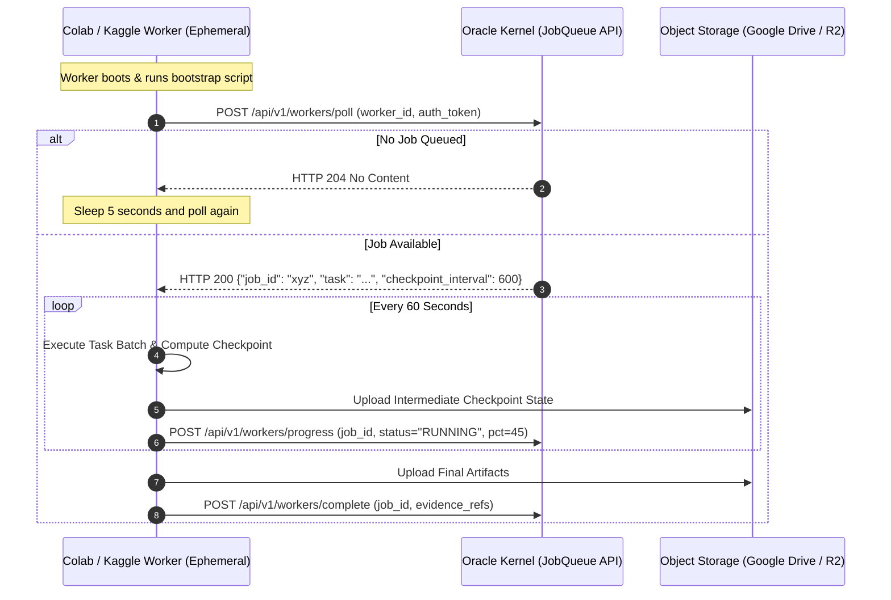

# Free Cloud Infrastructure & Distributed Resource Orchestration

**Status:** Draft for operator review  
**Version:** Draft 0.1  
**Authority:** Derived from Implementation Plan and Invariants ALN-012, ALN-014, ALN-015

---

## 1. Hardware Reality & Topology Overview

Autonomous engineering requires continuous operation, high memory capacity, and intermittent bursts of heavy GPU compute. Running frontier models locally is impractical on consumer hardware, and paying enterprise cloud GPU rental 24/7 is cost-prohibitive.

The Universal Brain infrastructure resolves this via a **Distributed Hybrid Topology**:
- **Operator Command Center:** Local PC (RTX 3050, 16GB RAM, 4GB VRAM, 512GB SSD).
- **24/7 Sovereign Kernel Node:** Oracle Cloud Always Free Tier (4 ARM cores, 24GB RAM).
- **Burst Batch Compute Nodes:** Ephemeral Free GPU Providers (Google Colab, Kaggle).
- **Persistent Auxiliary Services:** Hugging Face Spaces & GitHub Codespaces.
- **Out-of-Band Alert & Storage Channel:** Private Telegram Bot and Dedicated Archive Channel.

```mermaid
flowchart TD
    subgraph Local_PC ["Operator Command Center (Local RTX 3050)"]
        UI["Operator Console / CLI"]
        DevEnv["Local Development & Git Sync"]
        BrowserWorker["Local Browser Agent (Optional)"]
    end

    subgraph Oracle_Cloud ["Oracle Cloud Always Free (24/7 Sovereign Kernel)"]
        KernelNode["Universal Executive Kernel"]
        DB["PostgreSQL + Outbox"]
        JobQueue["Pull-Based Job Queue Engine"]
        ToolGW["Tool Gateway"]
        Replicator["Memory Replicator Daemon"]
        AlertService["Out-of-Band Alert Service"]
    end

    subgraph Ephemeral_GPUs ["Ephemeral Burst Compute (Free Tier - Pull-Based)"]
        Colab["Google Colab (T4 16GB - Up to 12h)"]
        Kaggle["Kaggle Notebooks (P100 / T4 - Up to 9h)"]
        HF["Hugging Face Spaces (Lightweight Microservices)"]
    end

    subgraph OutOfBand ["Out-of-Band Alerting & Deep Archive"]
        TelegramBot["Telegram Bot (Urgent Pushes & A2 Gating)"]
        TelegramChannel["Private Telegram Archive Channel (Free Unlimited 2GB Files)"]
    end

    UI <-->|Tailscale / SSH Tunnel| KernelNode
    KernelNode <--> DB
    KernelNode --> JobQueue
    JobQueue <-->|Poll / Progress (Outbound HTTPS)| Colab
    JobQueue <-->|Poll / Progress (Outbound HTTPS)| Kaggle
    ToolGW -->|Vector / Vision Inference Requests| HF
    Replicator -->|Sync Chunked Batches & Dump| External["Google Drive & GitHub"]
    Replicator -->|Tertiary Gzipped Archives| TelegramChannel
    AlertService -->|Urgent Alerts (Health/A2/Budget/Disk)| TelegramBot
```

---

## 2. Resource Allocation Matrix

| Resource Provider | Specifications | Assigned Role | Persistence & Disconnection Strategy |
|---|---|---|---|
| **Local PC** | Intel Core / AMD, RTX 3050 (4GB VRAM), 16GB RAM, 512GB SSD | **Operator Command Center:** Local UI, trace explorer, safe local filesystem staging, human verification terminal. | Local machine. Can be powered down anytime without affecting the 24/7 cloud Kernel. |
| **Oracle Cloud** *(Always Free)* | 4 OCPU (Ampere A1 ARM), 24GB RAM, 200GB Block Volume | **Sovereign Kernel Host:** Runs PostgreSQL, executive event loops, state machines, and Tool Gateway. | Permanent 24/7 uptime. Fully protected against hardware loss via 4-Tier Geo-Redundant Memory. |
| **Google Colab** *(Free)* | 1x Nvidia T4 (16GB VRAM), ~12GB RAM, 12h max session | **Heavy Batch Compute:** Adapter fine-tuning, large image batch processing, simulation runs (Isaac Sim / Gazebo headless). | Ephemeral. Pulls jobs outbound. Tasks are split into 10-minute chunked checkpoints. |
| **Kaggle** *(Free)* | 1x Nvidia P100 or 2x T4, 30h/week quota, 9h max session | **Research & Scraping Backup:** Large dataset transformations, literature ingestion, secondary batch runner. | Ephemeral. Pulls jobs outbound. Checkpoints written to cloud bucket; identical recovery protocol as Colab. |
| **Hugging Face Spaces** *(Free)* | 2 vCPU, 16GB RAM (or basic T4 space) | **Auxiliary Microservices:** Text embedding serving (`all-MiniLM-L6-v2`), fast tokenization, lightweight vision models. | Sleeps after 48h inactivity. The Kernel's health monitor issues keepalive pings every 30 minutes to maintain readiness. |
| **GitHub Codespaces** *(Free)* | 2-4 cores, 120 core-hours/month | **Isolated CI & Build Workbench:** Clean-room compilation tests, Docker container builds, linting and formatting. | Ephemeral container environment used strictly for verification and CI checks. |
| **Telegram Cloud** *(Free API)* | 2GB max file size, unlimited private channel storage | **Out-of-Band Alerts & Deep Cold Storage Sink:** Real-time push notifications to operator mobile; tertiary cold archive for logs/dumps. | Permanent cloud storage accessible via Telegram Bot API tokens. |

---

## 3. Ephemeral Worker Communication Protocol (Pull-Based Job Queue)

Google Colab and Kaggle instances **do not have public inbound IP addresses or open ports**. The Oracle Kernel cannot push jobs to them directly. All worker coordination is strictly **pull-based**:



### 3.1 Worker Lifecycle & Fault Recovery
1. **Bootstrap & Authentication:** When a Colab/Kaggle notebook starts, it runs a lightweight Python bootstrap script. It authenticates with a short-lived worker token generated by the Kernel and retrieved securely via the operator's Google Drive secrets store.
2. **Polling Loop:** The worker executes a loop issuing `POST /api/v1/workers/poll` every 5 seconds.
3. **Heartbeat & Failure Detection:** Every progress ping acts as a heartbeat. If no progress update is received from an active worker for **60 seconds**, the Kernel marks the worker as `LOST` and immediately re-queues the uncompleted job slice for another worker.
4. **Checkpoint Granularity:** Tasks assigned to ephemeral workers are chunked so that an intermediate state snapshot is committed every 10 minutes. When re-queued, the replacement worker resumes from the last verified checkpoint.
5. **Worker Fallback (Safe Sleep):** If the Oracle Kernel becomes temporarily unreachable during a job, the worker does not crash; it enters a "safe sleep" state, buffering intermediate outputs locally and retrying every 60 seconds for up to 6 hours before terminating.

---

## 4. Operator Alerting & Out-of-Band Notifications (Telegram / Signal)

To prevent the **"Silent Operator Crisis"** (where the Kernel halts on an A2 decision while the operator is away from the local web UI), the Kernel integrates an out-of-band push alerting service:

### 4.1 Urgent Alert Triggers

The Alert Service immediately dispatches high-priority push notifications to the operator's mobile device via a dedicated Telegram / Signal bot on:
1. **A2 Approval Required:** An agent proposes a consequential action (e.g. production deployment, financial API call, deleting workspace resources). Notification contains action summary, diff, and 6-hour expiration countdown.
2. **System Health Degradation:** Overall health index drops below **70%** or audit/verification service fails.
3. **Budget Threshold Breach:** API token expenditure crosses **80%** of monthly ceiling.
4. **Storage Exhaustion Warning:** Host SSD or cloud storage reaches **80%** capacity.
5. **Model Performance Degradation:** An active model family's success rate falls below 70% over 50 tasks.

### 4.2 Tertiary Cold Storage Sink
In addition to Google Drive and GitHub, the `memory_replicator` uses a private Telegram channel as a zero-cost tertiary cold storage sink:
- Gzipped monthly log archives, chunked `journal.jsonl` bundles, and daily database snapshots (<2GB per file) are uploaded to the private channel via Telegram Bot API (`sendDocument`).
- Provides immutable, off-site, zero-maintenance cold storage completely decoupled from Google and Oracle infrastructure.

---

## 5. Total Cost Profile

| Cost Item | Provider / Mechanism | Monthly Cost |
|---|---|---|
| 24/7 Sovereign Kernel Compute | Oracle Cloud Always Free (4 OCPU ARM, 24GB RAM) | **$0.00** |
| Relational Database (PostgreSQL) | Self-hosted inside Oracle Always Free instance | **$0.00** |
| Off-site Real-Time Event Journal | Google Drive (Standard Free 15GB Tier) / Cloudflare R2 | **$0.00** |
| Encrypted Backup Storage | GitHub Private Repository | **$0.00** |
| Out-of-Band Alerts & Tertiary Cold Sink | Telegram Bot API & Private Channel (Unlimited free 2GB files) | **$0.00** |
| Batch GPU Compute | Google Colab + Kaggle Free Tiers (Pull-based workers) | **$0.00** |
| Lightweight Auxiliary Services | Hugging Face Spaces (Free CPU/T4) | **$0.00** |
| Executive Reasoning APIs (Minimal) | Pay-as-you-go APIs for high-leverage planning | **$5.00 – $20.00** |
| Optional Consumer Browser Subscriptions | ChatGPT Plus or Claude Pro (for scraping worker) | **$0.00 – $20.00** |
| **Total Estimated Operating Cost** | | **$5.00 – $40.00 / month** |
